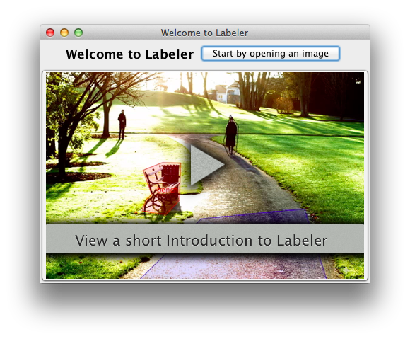
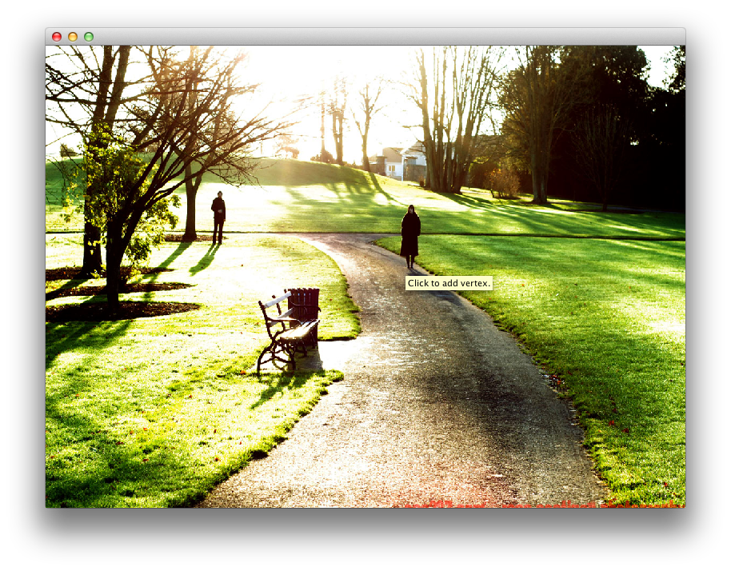

# Labeler design report #

### Jakub Hampl

Since our users are both volunteers (who will mainly be creating labels) and researchers (whose priority will be quick visualisation and editing) I decided to focus mainly on keeping the application very simple for light users (eg. volunteers) while adding some (slightly hidden) features useful for power users (researchers). As the application should be fairly universal I do not presuppose any directory structure and thus let the user open each image individually. Special care was taken to make the application easy to pickup for first time users.

# Description

When you open Labeler you will be presented by a welcome screen that offers two actions: *start working by opening an image* or *show a short video tutorial*.

When working on an image the app uses only the mouse and a few keyboard commands for all of it's operations. The app starts in **create** mode, where clicking on any unoccupied area will start creating a new polygon by adding it's first point and switch to **addition** mode. Clicking anywhere in addition mode will add more points, clicking on the first point (or pressing Enter) will complete the polygon and switch to **create** mode. Clicking on a already finished polygon will select it and enable editing it by dragging it's centre or corners and editing it's label by double clicking. 

This seemingly complex switching of modes is orchestrated to make the interface context dependent and the click do what the user expects to happen.

State is saved and loaded automatically on application exit and start respectively. The save command can also be used to trigger a save manually.

# Justification

## Labeling window design ##

I chose as our guiding principle and aesthetic minimalism. This is the reason why there are no buttons or other obvious controls visible in the main window. I try to maximize the area occupied by content, saving screen real estate and making the application appear more simple and uncluttered. The lack of visible controls invites the user to use his mouse to start directly interacting with the image, where almost all interactions with the application happen.

### Fitt's law ###

A principle of good design are the ergonomics of the application. These can be evaluated by Fitt's law. While a typical inference from this law is that controls should be either big or on the "infinite" edge of the screen, in this application I placed the controls in practically zero distance from the current mouse pointer. That is the main justification of abandoning any sort of buttons. 

The few controls we have, for example the corner points when editing have a large rendition, however their actual hit area (that is the area where clicks will be ascribed to these controls) is noticeably bigger to account for inaccuracies in the users pointing. When completing a polygon this is indicating by a "snapping" behaviour -- the projected line snaps to the starting point when the mouse is close enough to indicate a different action will happen on click.

### Immediate feedback

I've taken special care to update the UI in such manner that whenever executing any action the user receives feedback automatically and immediately. For example when creating a new polygon the new vertex is drawn also when just hovering the mouse so that the user has an exact idea what the consequence will be of clicking.

## Discoverability ##

The lack of controls has however one major disadvantage: discoverability. How can a user tell what to do if no obvious controls are initially presented? We solve this issue in three major ways:

### Consistency ###

I've taken care to mimic closely the behaviour of polygon editing in well known graphics programs like Photoshop or Illustrator. Thus users who have previous experience with these programs should pickup how to use this program very quickly (this was validated in user testing as users instinctively used familiar keyboard shortcuts successfuly).

### Contextual Help System

There are very few people in the world who actually read documentation or manuals to software. Typically they don't read much labels in user interfaces either. I think the reason this is so is that information presented at such moments is not useful at the time being. Why read a manual when chances are that I might figure it out on my own, a user might think. 

The application tries to present useful guidance to the user at the moment he needs it. Since our application is modal, we always show the user contextual tooltips advising what different actions are available to him in the current state.

Thus when the user is confused as to what he may do next, a few seconds of hovering on any object will tell him how to achieve whatever goal he may have.

### Introductory Video

The application starts with a screen where a video is featured rather prominently. This short clip visually demonstrates how to use most of the features that Labeler has to offer. The video is available at any time from the Help menu.

# Design Process

In steps:

1. Task requirements and user group analysed

2. Some ideas were brainstormed, most of these were then scratched as either not useful or non-realistic.
3. UI prototype coded with most interaction left uninplemented
4. Prototype validated (only by me, this would be better to do with others as well, alas I have not managed).
5. Finish coding whole project, test for bugs.
6. User testing: conducted informal user test with a participant who had little ability with computers. Asked participant to mark different objects and take note of her actions and confusions.
7. Go back to step 5. Ideally would iterate like this until program would be really good, due to time constraints only single iteration actually made.

## Unimplemented Features

### Snap to Edge

One of the first ideas was to optimise the ease of annotating images by guiding the users hand a bit. Te idea was to perform edge detection and then use cursor snapping (similar to what the app does when completing a polygon) to these edges. However I've chosen to abandon this feature after some development since:

- edges would either be invisible and thus the snapping would appear rather random
- or they would be visible possibly adding a lot of visual clutter and confusion
- the feature would need to be able to be turned off adding need for further chrome bloat
- the reliability of unsupervised edge detection isn't great, further adding to the confusion

### Web Sync

To automatically synchronise results with a web service that would store these. Would solve the problem of having the marker send the results to the researcher manually. Abandoned because it is not universal enough and it would require another component that I felt was not a big enough part of the requirement.

# Weaknesses

The main feature level weakness is the lack of assumption on directory structure for images, yet assuming a place where to save the written labels. I recognise this as the main weakness of the design and would be the first thing I would address in a future update to the application.

I have already mentioned the potential weakness of discoverability. 

Since the application is meant to be cross-platform, it should have code that makes it closer to the native conventions of its target platforms. This is especially noticeable on OS X, where without special flags to the `java` command the application looks more or less outlandish. An icon should be provided as well as registering as reader and writer of relevant filetypes. Also the program renders slightly differently on OS X (where I've developed most of it), and DICE leading to some graphical glitches.

Another major usability flaw is the fact that currently we assign colours in arbitrarily. This sometimes leaves regains with insufficient contrast:

Thus it would be much better to calculate maybe an average colour and then take the opposite colour to maximise contrast.

